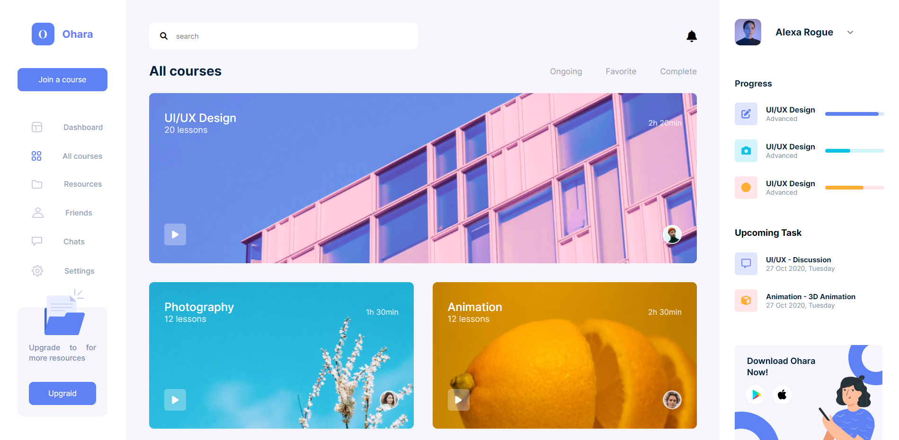

# Course-Dashboard

###The challenge

Users should be able to:
- Full width search box
- Collapse left side menu
- Motion effect for right sidebar elements
- Responsive design

### Screenshot

### Links

- Solution URL: [Solution URL ](https://github.com/meysamminoo/Course-Dashboard)
- Live Site URL: [Live site URL ](https://meysamminoo.github.io/Course-Dashboard)

### Build with

- Semantic HTML5 markup
- CSS custom properties
- Flexbox
- CSS Grid
